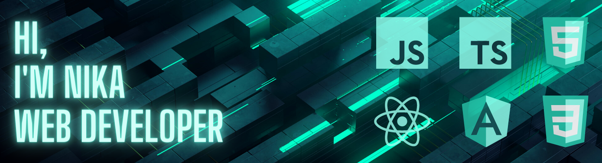

<h1 style="color: #93FFED; font-size: 3.5em;">Hi, I’m Nika Gogelia</h1>

<h3 style="color: #93FFED">I am Front-End React developer with appropriate proficiency in HTML, CSS, Javascript, and React.js. Motivated to get experience working on various projects in development teams. Improving technical and coding abilities as a web developer is the primary objective. To demonstrate what I can achieve with my expertise, I develop my own projects. I make an effort to learn more by working hard and being disciplined.</h3>

### - Please visit my website at **<a href="">Link</a>**

## **Contacts:**

  

# **Skills:**

**Programming languages:**

 

**Web Frameworks And Libraries:**

     

**Markup/Styling:**

  

**Version Control:**

 

**Package Manager:**

 

**Code Editor:**

**Microsft Office:**

   
